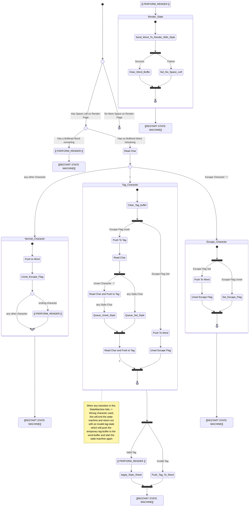

# Implementation

## Algorithm
1) Fill a ring buffer with bytes from the current file
2) Read characters from bytes and consume them into the state machine
3) once state machine finishes, call rendering function and wait for result
4) When successfull, fill up buffer and restart state machine
5) When unsuccessfull (page is full), cache word's codepoint and stylesheet and wait for next call
6) When new page selected, repeat

## Statemachine
For the state machine we need to define a few variables:
- Text-Buffer: a buffer containing the entire data of a page
- Word-Buffer: a buffer containing the characters of the word that is currently being assembled
- Tag-Buffer: a buffer that temporarily stores characters when handling tags
- StyleSheet: a collection of states of the different text-styling effects that are supported
- Escape-Flag: a simple flag, which determines if a character is interpreted or pushed to the word
- Has-Space-Left: a flag, set by the render call, which determines if we have used all of our space on the page, if so, we stop the state machine

We also need to define a few Characters
- End-Chars: All punctuation (. , ; :), exclamation (! ?) chars, and space
- Tag-Chars: < > for opening and closing a tag and [b,u,d,i etc.] for each style
- Escape Char: The escape character \

